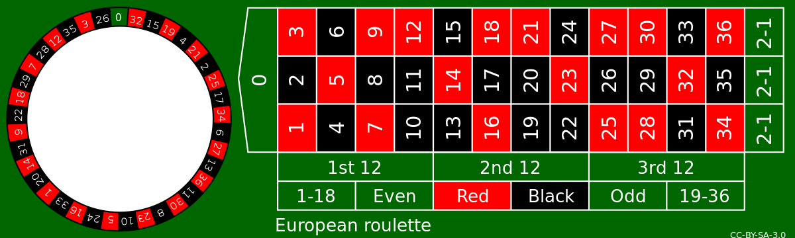

# Roulette



A feladatotok egy konzolos [Roulette](https://hu.wikipedia.org/wiki/Rulett_(szerencsej%C3%A1t%C3%A9k)) alkalmazás
elkészítése lesz. Az alkalmazás elindítása után kérdezze meg az alkalmazás, hogy mekkora összegbe szeretnék zsetont
váltani a játékhoz. Miután megadtam az összeget (minimum 1000 és maximum 10 000), ebből a keretből tudok játszani. A
későbbiekben nem vásárolhatok zsetont, ha a pénzem elfogy, a játék írja ki, hogy minden zsetonom elfogyott és zárodjon
be az alkalmazás.

Miután megadtam az átváltani kívánt összeget, a játék kérdezze meg, hogy mire szeretnék fogadni és mekkora összeggel. Az
alábbbi lehetőségeim vannak minden körben.

- Számra fogadni
    - Kifizetés 35:1
    - Ha ezt a lehetőséget választom az alkalmazás kérje be a számot.
- Színre fogadni
    - Kifizetés 2:1
    - Ha ezt a lehetőséget választom az alkalmazás kérje be a színt.
- Páros- /páratlanra fogadni
    - Kifizetés 2:1
    - Ha ezt a lehetőséget választom az alkalmazás kérje be, hogy páros vagy páratlan.
- 1-18 / 19-36 -ra fogadni
    - Kifizetés 2:1
    - Ha ezt a lehetőséget választom az alkalmazás kínálja fel a lehetőségeket és tudjak választani.
- 1-12 / 13-24 / 25 - 36
    - Kifizetés 3:1
    - Ha ezt a lehetőséget választom az alkalmazás kínálja fel a lehetőségeket és tudjak választani.

Oldd meg, hogy ha beléptem egy almenübe, onnan vissza tudjak lépni, ha meggondoltam magam. Például, ha azt állítottam,
hogy számra szeretnék fogadni, akkor mielőtt megadom a számot, valahogy tudjak visszalépni és inkább színre fogadni.

Ha olyan értéket, számot, színt, intervallumot adok meg, ami illegális, akkor a rendszer kezelje és javíthassam az
elírást vagy léphessek vissza a menübe. Minden körben egy log.txt-be írd ki a kör eredményét a következő formátumban.

```
[hanyadik kör] round: Starting balance: [A pénzem a kör elején] Bet on: [A fogadásom típuse és értéke] amount: [mennyi pénzzel fogadtam]$ [WIN/LOSE] new balance: [a pénzem a fogadás után]
```

Minden üzenet jelenjen meg a konzolon is, ugyan ilyen formátumban. A játék addig zajlík, amíg el nem fogy a pénzem vagy
el nem érem a kezdeti pénzem dupláját. Ha sikerült megkétszereznem a pénzem a játék írja ki, hogy győztem és zárodjon
be.